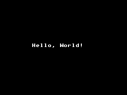

# SMSlib example "Hello, World!"

For platform(s): SMS

## Purpose

Show how to:
 - Compile and link code with SMSlib
 - Clear VRAM
 - Setup the automatic text renderer
 - Write to a location on the screen

## Screenshots

This example is not-interactive and the screen should look exactly like
this when run:

## Compilation

The included Makefile will build the example using the pre-compilied SMSlib found in
this repository. If you compiled SMSlib yourself, you can edit the Makefile to use
that library instead.

It is assumed that sdcc and tools such as ihx2sms are in your path.

Here is a break down of what the Makefile does:

Step 1: Individual source files are compiled to .rel objects using the -c option:

`sdcc -mz80 -I../../SMSlib/src --peep-file ../../SMSlib/src/peep-rules.txt -c main.c`

Step 2: .rel files are linked together. Here, crt0_sms.rel should come first, then the libraries, and finally
the individual .rel files. The result is a .ihx file (hello.ihx in this example)

`sdcc -o hello.ihx --no-std-crt0 --data-loc 0xC000 ../../crt0/crt0_sms.rel ../../SMSlib/src/SMSlib.lib    main.rel`

Step 3: The .ihx is converted to a .sms file using ihx2sms:

`ihx2sms hello.ihx hello.sms`

